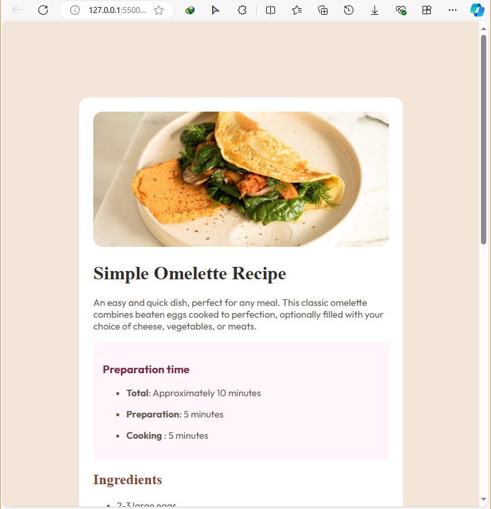
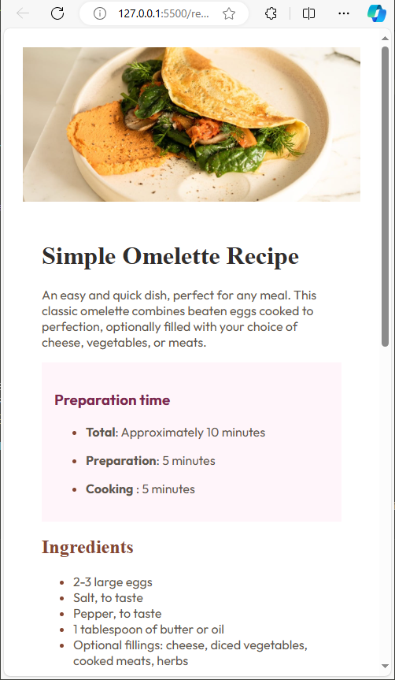

# Frontend Mentor - Recipe page solution

This is a solution to the [Recipe page challenge on Frontend Mentor](https://www.frontendmentor.io/challenges/recipe-page-KiTsR8QQKm). Frontend Mentor challenges help you improve your coding skills by building realistic projects. 

## Table of contents

- [Overview](#overview)
  - [The challenge](#the-challenge)
  - [Screenshot](#screenshot)
  - [Links](#links)
- [My process](#my-process)
  - [Built with](#built-with)
  - [What I learned](#what-i-learned)
  - [Continued development](#continued-development)
  - [Useful resources](#useful-resources)
- [Author](#author)
- [Acknowledgments](#acknowledgments)

**Note: Delete this note and update the table of contents based on what sections you keep.**

## Overview
This project was done in order to test and improve my understanding of HTML and CSS,which I was able to do successfully and
to make a responsive website by restricting my use of CSS property:display:flex.

### Screenshot




This is a screenshot of my work for Desktop Mode.


 


This is for Mobile Screens.


**Note: Delete this note and the paragraphs above when you add your screenshot. If you prefer not to add a screenshot, feel free to remove this entire section.**

### Links

- Solution URL: [Add solution URL here](https://your-solution-url.com)
- Live Site URL: [Add live site URL here](https://kofi100.github.io/RecipePageHTML-Chall/)

## My process

### Built with

- Semantic HTML5 markup
- CSS custom properties
- Flexbox( a bit)
- CSS Grid

**Note: These are just examples. Delete this note and replace the list above with your own choices**

### What I learned

Use this section to recap over some of your major learnings while working through this project. Writing these out and providing code samples of areas you want to highlight is a great way to reinforce your own knowledge.
Over this work,I learnt how to kinda efficiently structure your HTML work.
For best results,I think you got to:
-Write your plain text first.
-Structure them using HTML.
-Link and Apply CSS Effects to each element of the page,one step at a time,from the top.
-Repeat and Improve the HTML Layout and CSS Effects if needed.

I also revised my knowledge on media-queries.
This is my code for mobile and desktop screens(breakpoint is 500px for both.)

```css
/* for large screens >500px */
@media(min-width:500px){
    body{
        padding: 15%;
        background-color: var(--Stone100);

    }
    .bodyEdit{
        background-color: var(--White);
        padding: 1.5rem;
        border-radius: 1rem;
    }

}
/* for screens <500px */
@media (max-width:500px) {
    .top-image{
        border-radius: 0rem;

    }
    body{
        margin: 0rem;
    }
    .textBody{
        padding: 1.5rem;
    }
}
```
Notes:
-bodyEdit is a div element meant to contain every main content in the page,while,
-textBody is meant to contain the text below the image of the body. 

```html

```

```js

```

**Note: Delete this note and the content within this section and replace with your own learnings.**

### Continued development

For now,I think some things I will be working on are:
-Structuring stuff out for easy work.
-Font-importing.
-Utilizing Flex and Grid layouts for different purposes.
-using the  nth-child() and nth-last-child() fxns to do custom settings.

**Note: Delete this note and the content within this section and replace with your own plans for continued development.**

### Useful resources

- [W3Schools](https://www.w3schools.com/) - As usual,this website actually helped out a lot writing the codes for both HTML and CSS,out especially in font-importing.


**Note: Delete this note and replace the list above with resources that helped you during the challenge. These could come in handy for anyone viewing your solution or for yourself when you look back on this project in the future.**

## Author

- Website - [Kofi K](No website for now)
- Frontend Mentor - [@Kofi100](https://www.frontendmentor.io/profile/Kofi100)
<!-- - Twitter - [@yourusername](https://www.twitter.com/yourusername) -->

**Note: Delete this note and add/remove/edit lines above based on what links you'd like to share.**

## Acknowledgments

This is where you can give a hat tip to anyone who helped you out on this project. Perhaps you worked in a team or got some inspiration from someone else's solution. This is the perfect place to give them some credit.

**Note: Delete this note and edit this section's content as necessary. If you completed this challenge by yourself, feel free to delete this section entirely.**
